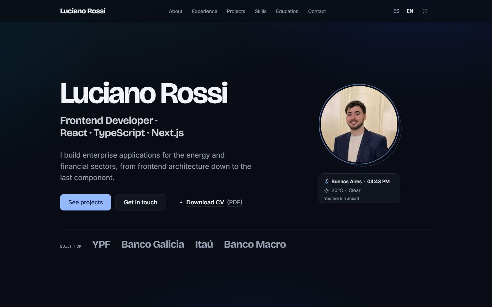

# Luciano Rossi — Frontend Developer

Personal portfolio: a bilingual (Spanish / English), light and dark site built with Next.js,
React and TypeScript, treated as a production product rather than a template.

**Live site:** [lucianorossiportfolio.vercel.app](https://lucianorossiportfolio.vercel.app)

<picture>
  <source media="(prefers-color-scheme: light)" srcset="docs/hero-light.jpg" />
  
</picture>

## Highlights

- **Accessibility as a requirement.** Full keyboard navigation, visible focus, skip link, semantic
  landmarks and an active-section nav announced to screen readers. WCAG AA contrast is enforced by a
  test for every semantic color pair in both themes, and axe runs in the test suite.
- **Two themes designed separately.** Colors are OKLCH design tokens; the dark theme has its own
  gradients, shadows and contrast instead of an inverted palette. No flash of the wrong theme.
- **Motion with restraint.** Content animations stay under 600 ms and only animate transform and
  opacity (no layout shift). Everything honors "reduce motion". The hero title never starts
  invisible, so it doesn't delay the Largest Contentful Paint.
- **A contact form built like a product feature.** One zod schema shared by client and server,
  validation on blur then on change, a live character counter, explicit states, errors wired with
  `aria-describedby`, a local draft that survives reloads, a honeypot plus minimum fill time, per-IP
  rate limiting and HTML-escaped emails sent with Resend.
- **Small, useful details.** Local time and weather in Buenos Aires with the visitor's time
  difference, a background tint that follows the real sun there, a cursor spotlight, and a copy
  button for visitors without a mail client.

## Tech stack

| Area          | Choice                                                         |
| ------------- | -------------------------------------------------------------- |
| Framework     | Next.js 16 (App Router), React 19                              |
| Language      | TypeScript 6 (`strict`)                                        |
| Styling       | Tailwind CSS 4 with CSS-first design tokens                    |
| Animation     | Motion (`motion/react`)                                        |
| i18n          | next-intl 4 with locale routing and typed message keys         |
| Forms         | react-hook-form + zod (`zod/mini` on the client)               |
| Email / abuse | Resend, Upstash rate limiting with an in-memory fallback       |
| Data          | Open-Meteo (weather, no API key) behind a cached route handler |
| Testing       | Vitest, React Testing Library, jsdom, axe-core                 |
| Quality       | ESLint 9 (zero warnings), Prettier, GitHub Actions CI          |

## Architecture decisions

- **Content is data.** Experience, projects, skills and education live in typed files under
  `src/content`; translatable copy lives in `messages/{es,en}.json`. Components only render. A test
  keeps both languages' keys and placeholders in sync.
- **Server Components by default.** Client code is limited to small islands: animation wrappers,
  toggles, the contact form and the live widgets. Only the translation namespaces those islands use
  are sent to the browser, and a test fails if one is missing.
- **Business logic separated from framework glue.** The contact submission logic
  (`features/contact/submit.ts`) receives its dependencies (rate limiter, email sender, clock), so
  every branch is unit-tested without network; the server action is a thin adapter.
- **Third parties behind our own routes.** Weather is fetched by a route handler cached for 10
  minutes at the CDN, so visitors never contact a third party and the upstream API sees a handful of
  requests per hour regardless of traffic.
- **Measured performance work.** Decisions such as the CSS-only hero entrance, the logo SVG sprite
  (which cut the HTML from 191 KB to 116 KB) and `zod/mini` came from Lighthouse and bundle
  measurements, not guesses.

Conventions for the codebase (naming, folder structure, design rules) are documented in
[`CLAUDE.md`](CLAUDE.md).

## Quality

- 211 tests across 25 files: schema rules, server logic, components, integration flows,
  accessibility (axe) and design-token contrast.
- CI runs format check, lint, typecheck, tests and a production build on every push.
- Lighthouse on a production build (desktop): 100 in Performance, Accessibility, Best Practices
  and SEO.

## Running locally

Requirements: Node 22 and npm.

```bash
npm ci
cp .env.example .env.local   # optional: every variable has a safe default
npm run dev                  # http://localhost:3000
```

| Script                 | What it does                       |
| ---------------------- | ---------------------------------- |
| `npm run dev`          | Development server                 |
| `npm run build`        | Production build                   |
| `npm run start`        | Serve the production build         |
| `npm test`             | Run the test suite once            |
| `npm run lint`         | ESLint, zero warnings allowed      |
| `npm run typecheck`    | Generate route types and run `tsc` |
| `npm run format:check` | Prettier check                     |

## Environment variables

All optional in development. See [`.env.example`](.env.example).

| Variable                                                   | Purpose                                                                                       |
| ---------------------------------------------------------- | --------------------------------------------------------------------------------------------- |
| `NEXT_PUBLIC_SITE_URL`                                     | Canonical URL for metadata, sitemap and Open Graph. Falls back to the Vercel production URL.  |
| `RESEND_API_KEY`, `CONTACT_TO_EMAIL`, `CONTACT_FROM_EMAIL` | Sending contact messages. Without them, development logs the message instead.                 |
| `UPSTASH_REDIS_REST_URL`, `UPSTASH_REDIS_REST_TOKEN`       | Shared rate limiting across serverless instances. Without them, an in-memory limiter is used. |

## Deployment

Deployed on Vercel from the `main` branch. Environment variables are set in the Vercel project
settings; the contact form requires the Resend variables in production.

---

© Luciano Rossi. The code is shared for review; the content (texts, photo, CV) is personal.
